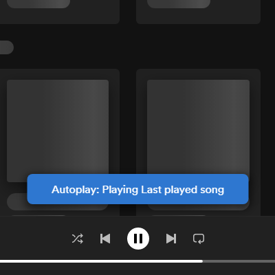

# Startup Autoplay
Directly play the last played song after you open Spotify.

Toggable in the Settings on the top right.

<br>

After Opening Spotify:


<hr>

## Installation
Install via [spicetify-marketplace](https://github.com/CharlieS1103/spicetify-marketplace)

<br>

Or the manual way:

Copy `startup-autoplay.js` (from the [dist](https://github.com/Ruxery/spicetify-startup-autoplay/tree/dist) branch) to the spicetify extensions folder
| **Platform**    | **Path**                               |
|-----------------|----------------------------------------|
| **MacOs/Linux** | `~/.config/spicetify/Extensions`       |
| **Windows**     | `%appdata%/spicetify/Extensions/`      |

Run the following commands
```sh
spicetify config extensions startup-autoplay.js
spicetify apply
```

<hr>

## More
🌟 Like it? Gimme some love!    
[](https://github.com/Ruxery/spicetify-startup-autoplay/)

If you find any bugs, please [create a new issue](https://github.com/Ruxery/spicetify-startup-autoplay/issues/new/choose) on the GitHub repo.    


Or look at the [Code](https://github.com/Ruxery/spicetify-startup-autoplay/tree/dev) 

<hr>

# Made with Spicetify Creator
Made with [Spicetify Creator](https://github.com/spicetify/spicetify-creator)
